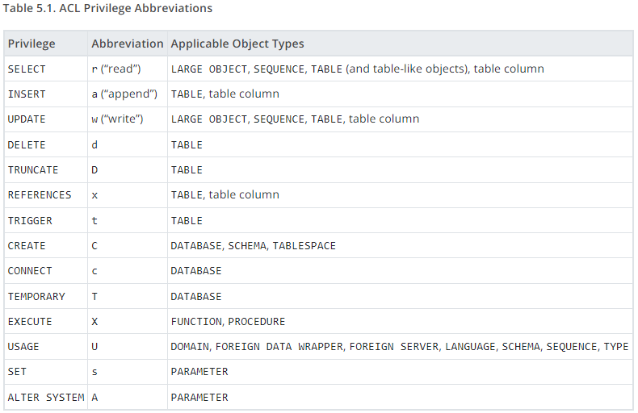
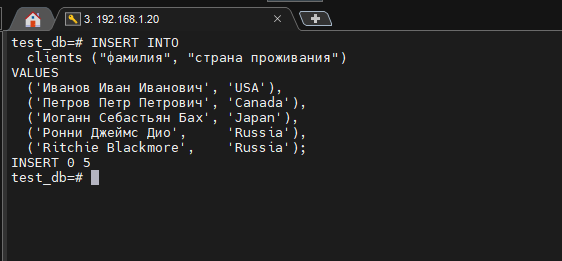
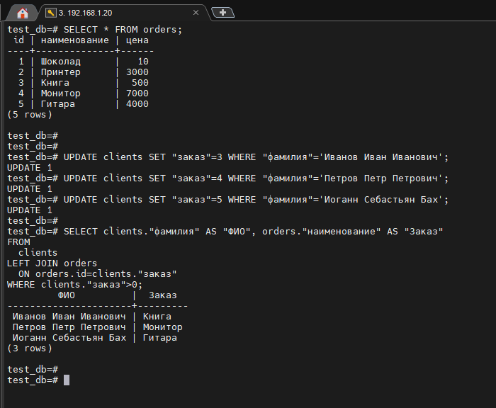
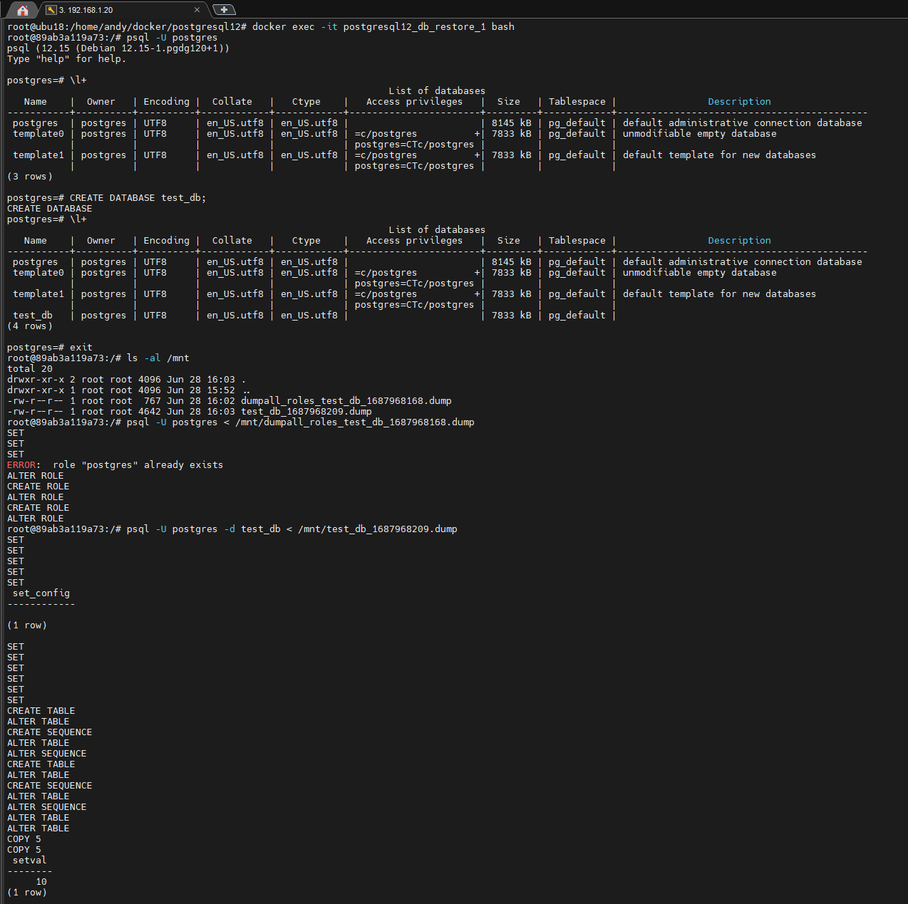
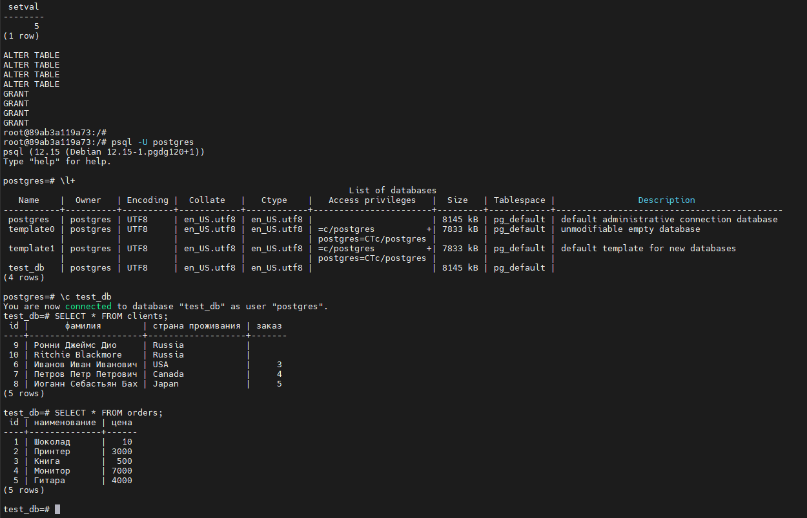

# Домашнее задание к занятию 2. «SQL»

## Задача 1

**<em>Используя Docker, поднимите инстанс PostgreSQL (версию 12) c 2 volume, 
в который будут складываться данные БД и бэкапы. Приведите получившуюся команду или docker-compose-манифест.</em>**
``` yaml
version: "3.1"
services:
db:
    image: postgres:12
    restart: always
    environment:
    POSTGRES_USER:     "postgres"
    POSTGRES_PASSWORD: "postgres"
    volumes:
    - db-data:/var/lib/postgresql/data
    - db-backup:/mnt

volumes:
db-data:
db-backup:
```


## Задача 2

- создайте пользователя test-admin-user и БД test_db;
- в БД test_db создайте таблицу orders и clients (спeцификация таблиц ниже);
- предоставьте привилегии на все операции пользователю test-admin-user на таблицы БД test_db;
- создайте пользователя test-simple-user;
- предоставьте пользователю test-simple-user права на SELECT/INSERT/UPDATE/DELETE этих таблиц БД test_db.

Приведите:

- итоговый список БД после выполнения пунктов выше;  
  

- описание таблиц (describe);  
  

- SQL-запрос для выдачи списка пользователей с правами над таблицами test_db;  
    ``` sql
    SELECT * FROM information_schema.role_table_grants;
    ```

- список пользователей с правами над таблицами test_db.  
  

  

## Задача 3

**<em>Используя SQL-синтаксис, наполните таблицы тестовыми данными:</em>**  
  

  


** <em>вычислите количество записей для каждой таблицы.</em>**  
  


## Задача 4 


**<em>Используя foreign keys, свяжите записи из таблиц</em>**  
**<em>Приведите SQL-запрос для выдачи всех пользователей, которые совершили заказ, а также вывод этого запроса.</em>**  
  

## Задача 5

**<em>Получите полную информацию по выполнению запроса используя директиву EXPLAIN</em>**  
  

**<em>Приведите получившийся результат и объясните, что значат полученные значения.</em>**  
**Seq Scan** - указывает что чтение из таблици было последовательным.  
**Cost**  - цена/время затраченое на чтение первой строки и всех строк соответственно.  
**Rows**  - кол-во строк возвращяемых запросом на остовании из данных планировщика.  
**Width** - среднее значение длины строки в байтах. 


## Задача 6

Создайте бэкап БД test_db и поместите его в volume, предназначенный для бэкапов (см. задачу 1).  
Остановите контейнер с PostgreSQL, но не удаляйте volumes.  
Поднимите новый пустой контейнер с PostgreSQL.  
Восстановите БД test_db в новом контейнере.  
Приведите список операций, который вы применяли для бэкапа данных и восстановления.  

**Создание резервной копии**  
  

**Восстановление из резервной копии**  
  
  

---
